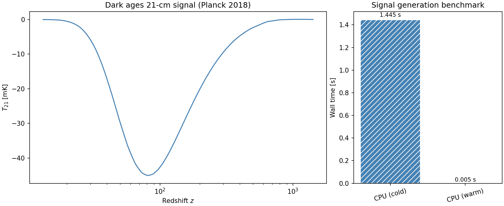

# Summary

The field of 21-cm Cosmology aims to observe the evolution of the early universe between redshifts of 1100 and 6 (corresponding to roughly 400,000 years after the big bang to 2 billion years) through the 21-cm emission from neutral hydrogen. The signal arises from the spin flip transition in neutral hydrogen when the proton and electron spins transition from aligned to anti-aligned and vice versa emitting or absorbing a photon with a wavelength of 21-cm. While the transition is very rare (known as a forbidden transition) the amount of neutral hydrogen in the early Universe means that the 21-cm signal from this period in cosmic history, known as the dark ages and cosmic dawn, can be measured with radio telescopes on earth and in the future on the moon in the 1-200 MHz frequency range.

The relative numbers of atoms in each spin state, characterized by a spin temperature $T_s$, in the early Universe is driven by interactions with Cosmic Microwave Background (CMB) photons with a wavelength of 21-cm. However, at various times in cosmic history $T_s$ is driven by collisions between hydrogen atoms in the gas ($z \approx 300 - 30$), light from the first stars ($z \approx 30 -6$) and X-ray emission from exotic objects like X-ray binaries ($z \approx 20 - 6$). These process couple the spin temperature to the gas temperature $T_k$ which is cooler than the CMB $T_\gamma$ and so the 21-cm signal is seen in absorption against the radio background at different epochs.

\texttt{hyprfine} is an analytic simulation of the sky-averaged 21-cm signal from $z=1100 - 6$ written using JAX and Python for native GPU capabilities. It models the average temperate of the 21-cm signal over cosmic time given by

$$T_{21} = 54 (1 - x_e) \frac{(1 - Y_{\rm He})}{0.76} \frac{\Omega_b h^2}{0.02242} \sqrt{\frac{0.1424}{\Omega_m h^2}\frac{1+z}{40}}\bigg(1 - \frac{T_{\rm CMB}}{T_s}\bigg)$$

as a function of the $\Lambda$-CDM cosmology parameters and the astrophysics of the first stars and galaxies. The code is the first analytic GPU native simulation of the 21-cm signal, runs in a fraction of a second, parellelises efficiently across a GPU, is differentiable up to $z=35$ and is designed to be easily extended to include additional physics and more complicated simulation approaches.

# Statement of need

A number of global or sky-averaged 21-cm signal experiments have collected data in recent years or are currently collecting data (EDGES @Bowman2018EDGES; SARAS @Singh2022SARAS, @Bevins2022SARAS; REACH @Acedo2022REACH). In order to analyse this data researchers rely on Bayesian inference techniques (@Anstey2021BayesianForegrounds, @Bevins2022SARAS, @Bevins2022SARAS2, @Acedo2022REACH, @Pochinda2024PopIII, @Dhandha2025JWST21cm1, @Dhandha2025JWST21cm2, @Tutt2026GPU21cm) and neural network emulators (@Cohen202021cmGEM, @Bevins2021GLOBALEMU, @Bye2022VAE21cm, @Breitman2024EMU21cm, @DorigoJones2024LSTM21cm, @DorigoJones2025KAN21cm) of complex semi-numerical simulations (@Mesinger2011FAST21cm, @Murray202FAST21cm, @Visbal2012FirstStars, @Fialkov2012RelativeMotion).

These semi-numerical simulations take order hours to run per parameter set and in inference loops the model has to be called 100,000s to millions of time. As a result emulators have become a crucial piece of infrastructure in the field with the state-of-the-art emulators being able to accurate recover the 21-cm signal in a fraction of a second. However, emulators are inherently approximations of the underlying physics model and \texttt{hyprfine} offers a millisecond evaluation of the signal at no cost to accuracy.

\texttt{hyprfine} currently includes key affects like collisional coupling, the Wouthuysen-Field () coupling and X-ray heating. While it is mission some more minor affects like lyman-alpha heating and multiple scattering, these can be added easily and the code developed while maintaining the parallelizm afforded by modern GPU architectures.

# State of the field

A number of other 21-cm simulation codes exist, and they fall roughly into three different classes; numerical, semi-numerical and analytic models. 

$C^2$-ray [@Mellema2006C2ray] is a numerical code written in Fortran90 focused on the Epoch of Reionization between redshifts $z=20$ and $z=6$. The radiative transfer algorithm uses ray-tracing to post process cosmological N-body simulations and calculate the ionization field from which the 21-cm signal can be calculated. The recent pyC$^2$ray upgrade uses a novel ray-tracing algorithm written in C++ with CUDA and a combination of Fortran90 and Python to compute the relevant chemistry and provide a user interface. In @Hirling2024pyc2ray the authors benchmarked pyC$^2$ray on an NVIDIA Tesla P100 and performed post-processing of a 349 MPc$^3$ N-body simulation in $\approx$ 2.5 GPU hours. The equivalent simulation using an older version of the code takes days to run on a CPU (13,824 core hours on 128 cores in parallel).

Two widely used semi-numerical codes are 21cmFAST and 21cmSPACE. 21cmFAST, like pyC$^2$ray is an open source code base written with Python and C.

hyprfine is an analytic code and is most similar to zeus21 and ECHO21.

| Code | Simulation Type | Products | Approx. Redshift | GPU? | Programming Lang./Framework | Open Source |
|------|-----------------|----------|------------------|------|-----------------------------|-------------|
| pyC$^2$ray | Numerical |  Spatially resolved ionization field | 21 - 6 |Yes (partial) | Python, Fortran90, C++, CUDA | Yes |
| 21cmFAST | Semi-numerical | 21-cm simulation box, summary statistics and more | 50 - 6 | Yes (partial) \textbf{Need to check this!} | Python, C | Yes |
| 21cmSPACE | Semi-numerical | 21-cm simulation box, summary statistics and more | 50 - 6 | No | Matlab, Python | No |
| Zeus21 | Analytic | 21-cm global signal, power spectrum, UVLF | 35 - 5 | No | Python | Yes |
| ECHO21 | Analytic | 21-cm global signal | 1500 - 0 | No | Python | Yes |
| ARES | Semi-analytic/1D RT | 21-cm global signal and more | 35 - 5 | No | Python | Yes |
| hyprfine | Analytic | 21-cm global signal | 1100 - 0 | Yes | Python, JAX | Yes |

# Software design

# Research impact statement

# AI usage disclosure

# Acknowledgements

# References