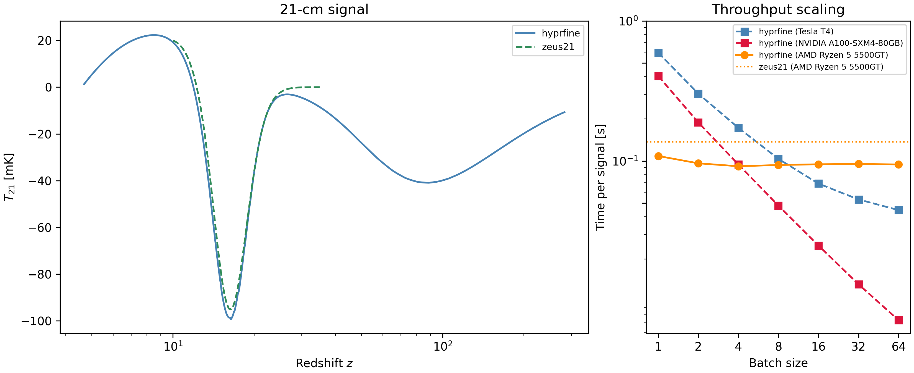

# Summary

The field of 21-cm Cosmology aims to observe the evolution of the early universe between redshifts of 1100 and 6 (corresponding to roughly 400,000 years after the big bang to 1 billion years) through the 21-cm emission from neutral hydrogen. The signal arises from the spin flip transition in neutral hydrogen and the relative number of atoms with aligned and anti-aligned proton and electron spins is characterized by a statistical temperature called the spin temperature. At various times the spin temperature $T_s$, is driven by interactions with Cosmic Microwave Background (CMB) photons with a wavelength of 21-cm, collisions between hydrogen atoms in the gas ($z \approx 300 - 30$), light from the first stars ($z \approx 30 -6$) and X-ray emission from exotic objects like X-ray binaries ($z \approx 20 - 6$). These processes couple the spin temperature to the gas temperature $T_k$ which is cooler than the CMB $T_\gamma$ and so the 21-cm signal is seen in absorption against the radio background at different epochs.

\texttt{hyprfine} is an analytic simulation of the sky-averaged 21-cm signal from $z=1100 - 6$ written using JAX and Python for native GPU capabilities. It models the average temperature of the 21-cm signal over cosmic time given by

$$T_{21} = 54 (1 - x_e) \frac{(1 - Y_{\rm He})}{0.76} \frac{\Omega_b h^2}{0.02242} \sqrt{\frac{0.1424}{\Omega_m h^2}\frac{1+z}{40}}\bigg(1 - \frac{T_{\rm CMB}}{T_s}\bigg)$$

as a function of the $\Lambda$-CDM cosmology parameters and the astrophysics of the first stars and galaxies. As far as we are aware, the code is the first analytic GPU native simulation of the 21-cm signal. It runs in a fraction of a second, parallelises efficiently across a GPU and is differentiable through the Dark Ages ($z \geq 35$).

# Statement of need

A number of global or sky-averaged 21-cm signal experiments have collected data in recent years or are currently collecting data (EDGES @Bowman2018EDGES; SARAS @Singh2022SARAS, @Bevins2022SARAS; REACH @Acedo2022REACH). In order to analyse this data researchers rely on Bayesian inference techniques [@Anstey2021BayesianForegrounds; @Bevins2022SARAS; @Bevins2022SARAS2; @Acedo2022REACH; @Pochinda2024PopIII; @Dhandha2025JWST21cm1; @Dhandha2025JWST21cm2; @Tutt2026GPU21cm] and neural network emulators [@Cohen202021cmGEM; @Bevins2021GLOBALEMU; @Bye2022VAE21cm; @Breitman2024EMU21cm; @DorigoJones2024LSTM21cm; @DorigoJones2025KAN21cm] of complex semi-numerical simulations [@Mesinger2011FAST21cm; @Murray2020FAST21cm; @Visbal2012FirstStars; @Fialkov2012RelativeMotion].

These semi-numerical simulations take order hours to run per parameter set and in inference loops the model has to be called 100,000s to millions of times. As a result emulators have become a crucial piece of infrastructure in the field with the state-of-the-art emulators being able to accurately recover the 21-cm signal in a fraction of a second. However, emulators are inherently approximations of the underlying physics model (@Bevins2025PosteriorRecovery) and \texttt{hyprfine} evaluates the model directly in tens of milliseconds on a GPU, without training an emulator on the full signal.

\texttt{hyprfine} currently includes key effects like collisional coupling, the Wouthuysen-Field and X-ray heating. Additional effects such as Lyman-$\alpha$ heating can easily be added and the code developed while maintaining the parallelism afforded by modern GPU architectures.

# State of the field

21-cm simulation codes fall broadly into three classes, numerical, semi-numerical and analytic, which trade physical detail for speed (\autoref{tab:codes}). Only a small number of publicly available simulation codes make use of GPUs.

Numerical codes solve the radiative transfer directly. $C^2$-ray [@Mellema2006C2ray] is written in Fortran90 and post-processes cosmological N-body simulations with ray-tracing to compute the ionization field during the Epoch of Reionization ($z \approx 20 - 6$), from which the 21-cm signal can be derived. Its successor pyC$^2$ray [@Hirling2024pyc2ray] moves the ray-tracing to C++ and CUDA with a Python interface. On an NVIDIA Tesla P100 it post-processes a (349 Mpc)$^3$ N-body simulation in $\approx 2.5$ GPU hours, compared with 13,824 core hours for the original CPU code. Even on a GPU, simulations like these are far too expensive for parameter inference.

Semi-numerical codes such as 21cmFAST [@Mesinger2011FAST21cm, @Murray2020FAST21cm] and 21cmSPACE [@Visbal2012FirstStars, @Fialkov2012RelativeMotion] use approximate methods such as excursion-set ionization and analytic radiation fields to produce 21-cm boxes from which the global signal and power spectrum are calculated. They take on the order of hours per parameter set, which is why emulators of them are used for inference.

Analytic codes compute the sky-averaged quantities directly and are the closest relatives of \texttt{hyprfine}. ARES [@Mirocha2014ARES] models the global signal from cosmic dawn onwards and treats the radiation background with one-dimensional radiative transfer. Zeus21 [@Munoz2023Zeus21] computes the global signal and power spectrum in $\lesssim 1$ s by exploiting the approximately exponential dependence of the star formation rate density on the density field, and agrees with 21cmFAST to $\sim 10\%$. ECHO21 [@Mittal2026ECHO21] models the global signal from the Dark Ages to the end of reionization in $\mathcal{O}(1)$ s, includes Lyman-$\alpha$ heating and allows the cosmological parameters to vary. All three run on CPUs with NumPy and SciPy, and ECHO21 speeds up large model grids by spreading them across CPU cores.

\texttt{hyprfine} follows these codes in its physics, for example in using the star formation rate density model of @Munoz2023Zeus21, and \autoref{fig:benchmark} compares it with Zeus21 for identical parameters. The difference is where and how it runs. Making an existing code GPU-native and differentiable would mean rewriting every integrator, interpolator and ODE solver in JAX and replacing calls to external CPU codes (e.g. CLASS [@Blas2011CLASS2] in Zeus21, recombination codes [@Lee2020HYREC2]). That amounts to a rewrite, so \texttt{hyprfine} was written as a new, JAX-native package. It is the first analytic 21-cm code that runs natively on a GPU, evaluates large batches of models in parallel and provides gradients with respect to its parameters.

| Code | Simulation Type | Products | Approx. Redshift | GPU? | Programming Lang./Framework |
|-----------|-------------------|--------------------------|-------------|--------|-------------------------|
| pyC$^2$ray | Numerical |  Spatially resolved ionization field | 21 - 6 |Yes (partial) | Python, Fortran90, C++, CUDA |
| 21cmFAST | Semi-numerical | 21-cm simulation box, summary statistics and more | 50 - 6 | No | Python, C |
| Zeus21 | Analytic | 21-cm global signal, power spectrum, UVLF | 35 - 5 | No | Python |
| ECHO21 | Analytic | 21-cm global signal | 1500 - 0 | No | Python |
| ARES | Semi-analytic/1D RT | 21-cm global signal and more | 35 - 5 | No | Python |
| \texttt{hyprfine} | Analytic | 21-cm global signal | 1100 - 6 | Yes | Python, JAX |

: An inexhaustive list of publicly available 21-cm simulation codes with their simulation type, outputs, approximate redshift range, GPU support, and implementation language. \label{tab:codes}

# Software design

\texttt{hyprfine} is written in a functional style around JAX. Every physical ingredient is a pure, just-in-time compiled function of redshift and two parameter containers, \texttt{cosmology} and \texttt{astrophysics}. These are Python named tuples and therefore JAX pytrees, so the full simulation can be vectorised over parameter sets with \texttt{jax.vmap}, distributed across GPU cores and differentiated with \texttt{jax.grad} without any bespoke code. This choice favours simple, composable functions over an object-oriented simulation class with internal state, which would be harder to trace and compile.

The top-level \texttt{generate\_signal} function chains the physics together. At $z \geq 35$ the free electron fraction $x_e$ and gas temperature $T_k$ are taken from a neural network emulator of the recombination code HYREC-2, built with \texttt{astroemu}[^astroemu]. Wrapping the original C code would require leaving the GPU and would break differentiability; the emulator keeps the whole pipeline on-device at the cost of a small emulation error ($\lesssim 3 \%$ in $x_e$ and $\lesssim 1\%$ in $T_k$). Below $z = 35$, $T_k$, the background ionization fraction and the filling factor of ionized bubbles are evolved as a stiff system of ordinary differential equations, sourced by X-ray heating and ionizing photons from the first galaxies, using the implicit \texttt{Kvaerno5} solver from \texttt{diffrax} [@Kidger2022NeuralDE]. Collisional and Wouthuysen-Field coupling coefficients, the spin temperature and $T_{21}$ are then evaluated on the requested frequency grid. The code runs in double precision throughout. Currently the Dark Ages portion of the signal is differentiable, and extending gradients through the cosmic dawn solve is ongoing work.

[^astroemu]: <https://github.com/htjb/astroemu>

The code is organised into one module per physical process: cosmology, the matter power spectrum and $\sigma(M)$, the halo mass function and star formation rate density, Lyman-$\alpha$ emissivity, X-ray emissivity, coupling coefficients and temperatures. Each module is tested on its own. New physics such as Lyman-$\alpha$ heating can therefore be added as a new function and inserted into the ODE vector field or the spin temperature calculation without changing the rest of the code.

This modular structure is also designed to support a future extension to the 21-cm power spectrum. The ingredients needed for a fluctuation model are already general, differentiable functions of scale, mass and redshift: the linear matter power spectrum, $\sigma(M)$, growth factors, the halo mass function, star formation efficiency and the Lyman-$\alpha$ and X-ray emissivities. These building blocks can be reused directly by an analytic power spectrum model similar to that of zeus21 or even a semi-numerical simulation, keeping the GPU parallelism and differentiability of the global signal code.

# Research impact statement

An early version of \texttt{hyprfine} has already been used in published research [@Bevins2026ApJL], where it was used to assess the constraining power of early and late time probes of cosmology on the Dark Ages 21-cm signal.

More broadly, \texttt{hyprfine} targets a bottleneck in current global 21-cm analyses. Bayesian inference of data from experiments such as EDGES, SARAS and REACH requires $10^5$–$10^6$ model evaluations, which has so far required neural network emulators trained on expensive semi-numerical simulations. \texttt{hyprfine} evaluates the physical model directly in a fraction of a second per signal on a GPU and can evaluate large batches of parameter sets in parallel (\autoref{fig:benchmark}), making inference with the physical model itself practical. Its coverage from $z=1100$ makes it suitable for forecasting and analysis for proposed lunar Dark Ages experiments, and its differentiability enables gradient-based samplers and Fisher forecasts. As experiments move their inference pipelines to GPUs [@Tutt2026GPU21cm; @Tutt2026Beams] with frameworks like BlackJAX [@cabezas2024blackjax], \texttt{hyprfine} provides a fast and efficient GPU native way to model the 21-cm signal. The code is released on PyPI under the MIT licence with documentation, tutorials and a test suite, ready for use and extension by the community.

# Conclusions

\texttt{hyprfine} is in active development. We are currently assessing the feasibility of adding additional physics into the model including Lyman-$\alpha$ heating [@Reis2021LyAlpha21cm] and alternative dark matter models. Furthermore, we aim to make the Cosmic Dawn component of the code differentiable and will explore alternative ODE solvers like modax [@Berry2026MODAX] and GRADSOLVE [@SpurioMancini2026GRADSOLVE]. In the long run we hope to see \texttt{hyprfine} evolve to include a GPU compatible and differentiable semi-analytic model of the 21-cm signal that can be rapidly evaluated either during inference or alternatively to generate larger training data sets for more accurate emulation than is possible with existing frameworks. A GPU compatible model of the 21-cm signal with a differentiable Dark Ages component is a timely addition to the 21-cm inference landscape as researchers move their pipelines on to the GPU [@Tutt2026GPU21cm; @Tutt2026Beams] and a number of experiments targeting observations of the dark ages signal from the moon come online [@de2026cosmocube].

\texttt{hyprfine} offers a GPU compatible way to model the 21-cm signal across a large period of cosmic history, is differentiable through the dark ages and parallelisable.

# AI usage disclosure

Anthropic's CLAUDE and CLAUDE Code were used in the development of \texttt{hyprfine}, the writing of the documentation and the writing of this paper. The models were used to write test suites, benchmarking codes, helped debugging runtime issues and with software design choices. All AI generated code and text were reviewed and validated by the author who takes full responsibility for the code and paper. In particular where AI models contributed to the coding of the physics modules, the author rigorously checked the work against the literature.

# Acknowledgements

HTJB acknowledges support from Imperial College London and Schmidt Science through an Imperial College Research Fellowship. The authors acknowledge the use of resources provided by the Isambard 3 Tier-2 HPC Facility (APP63640). Isambard 3 is hosted by the University of Bristol and operated by the GW4 Alliance (https://gw4.ac.uk) and is funded by UK Research and Innovation; and the Engineering and Physical Sciences Research Council [EP/X039137/1].

# Reference